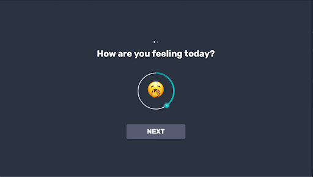
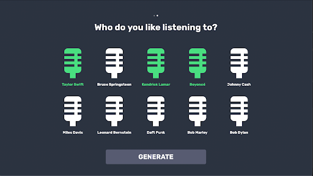

  
  <h1 align="center" style="border-bottom: none"><b>CEN4721 - Human-Computer Interaction</b></h1>

  

    While I was an exchange student at the University of Florida, I had taken this class which focuses on understanding and designing interactive systems.
     
    More information can be found <a href="https://www.cise.ufl.edu/research/lok/teaching/hci-s15/syllabus-abet.pdf">Here</a>.
  

 

  <h2 align="left" style="border-bottom: 1px solid gray">Project</h2>

  During this class, I teamed up with 3 other students to build a website called GrooveGuru.
   
  This website allows users to enter a bunch of details such as mood, favorite genres and artists, and then receive a custom generated playlist made for them.
   
  It uses the NextJS with Spotify API to generate the playlists and display them for the users.

 

  <h2 align="left" style="border-bottom: 1px solid gray">Media</h2>

  

    
     
    
     
    
  

 

  <h2 align="left" style="border-bottom: 1px solid gray">Contributing</h2>

  

    Pull requests are welcome. For major changes, please open an issue first to discuss what you would like to change.
  

 

  <h2 align="left" style="border-bottom: 1px solid gray">License</h2>

  

    <a href="https://creativecommons.org/licenses/by-nc-sa/3.0/">Licensed under Creative Common Attribution-NonCommercial-ShareAlike 3.0 Unported License</a>
  

